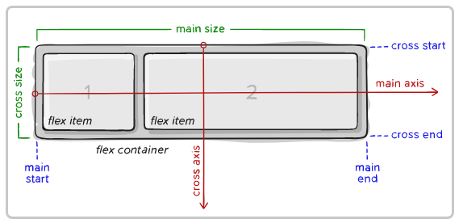

complete guide to flexbox
[flexbox](https://css-tricks.com/snippets/css/a-guide-to-flexbox/#background) 

## Background
- <b>FlexBox</b> aims at providing a more efficient way to lay out, align and distribute space among items in a container, even when their size is unknown and or dynamic. 

The main idea behind the flex layout is to gve the container the ability to alter its items width/height (and order) to best fill the available space(mostl to accomodate to all kind of display devices and screen sizes). A flex container expands items to fill available free space or shrinks them to prevent overflow.
 

Most importantly, the flexbos layout is direction-agnostic as opposed to the regular layouts(block which is vertically-based and inline which is horizontally-based). While those work well for pages they lack flexibility(no pun intended) to support large or complex applications(especially when it comes to orientation changing,resizing, stretching, shrinking etc.)

<code>
Note: <b>Flexbox</b> layout is most appropriate to the components of an application, and small-scale layouts, while Grid layout is intended for larger scale layouts. 

## Basics and Terminology
Since flexbos is a whole module and not a single property, it involves a lot of things including its whole set of properties.Some of them are meant to be set on the container (parent element, Known as "flex container"),whereas the others are meant to be set on the children (said "flex items"). 

If "regular" layout is based on both block and inline flow directions,the flex layout is based on flex-flow directions.Please have a look at this figure from the specification, explaining the main idea behind the flex layout. 

